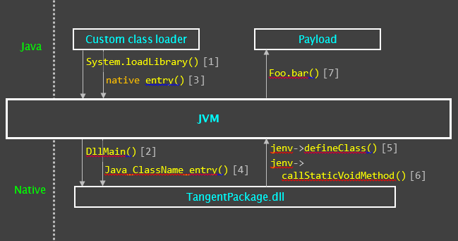
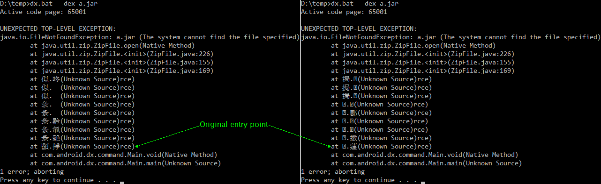

# Native Java Packer

Copyright (c) 2023, Tangent65536.  
**All rights reserved.**  
The original repo has been set to private due to me being stupid and not careful enough to remove (no longer) sensitive information. This is a republished version. `>.<`  

---

## Notice

*This repository contains only a demo output (`dx` tool from Android SDK packed by this packer) and is **not** released under any license. You may **NOT** derive any product from this repository unless explicitly granted permission by the author. Since I cannot find any legit use case for this tool other than personal use, I will not release the source code. This is to mitigate the risks of potential abuse.*  

**For anti-malware solutions providers:** Please flag the binary files in the `output` folder as potentially unsafe, just like files packed with tools such as `VMProtect`. Maybe mark them as `Tangent's Packer`.  

`^.^`

---

## Abstract

This tool packs a Java program archive (`JAR`) into a `.dll` file along with a small loader. The underlying java class files are encrypted and encoded in a custom format in the output `.dll` and are obscure to primitive inspections. During runtime, class files are injected directly into the `JVM` via `JNI` by a custom `ClassLoader` implementation. Furthermore, all packed classes and their members are dynamically renamed on the fly, including the original entry point. A custom PRNG is used to generate class and member names that are unique and transient to each session.  

You may find a demo program in the `output` folder. It's derived from the official `dx` tool coming with the Android SDK `30.0.1`.  

---

## Background

Packers are one of the most common tools to hide codes from reverse-engineering attempts, alongside a wide variety of obfuscation and virtualization techniques. Such tools are adapted and heavily abused by cybercriminals to obscure raw malicious code and bypass static analysis/detections. Nevertheless, for some languages, such as Java and C#, defeating packers is often a little bit easier than that against native executables, since the compiled programs of those languages are in the form of bytecodes and can usually be decompiled using common tools like [CFR](https://github.com/leibnitz27/cfr) or [dnSpy](https://github.com/dnSpy/dnSpy). The goal of this project is simple: try to create a packer that is more resilient to common static analysis tools against Java programs.  

Packed Java programs usually come in as a JAR archive with a few entry classes and a bunch of encrypted data files that contain either the encrypted payloads or the information to retrieve them. These payloads are often loaded into the memory directly by implementing a custom `ClassLoader`. Earlier samples mostly come with a simple encryption implementation and put the encrypted JAR or class files in the stub, and can be easily defeated using common decompilers ([example](https://github.com/tan2pow16/SimpleDeqryptor19M07A)). In more recent years, attackers tend to use obfuscators that abuse the `invokedynamic` opcode to crash decompilers. Nevertheless, certain signatures, or "choke points", are almost always present in the unpacker code. Commonly, packers would use `ByteArrayOutputStream` to fetch the decrypted data and form a byte array that can be fed into a `JarInputStream` (via `ByteArrayInputStream`) or the `defineClass()` method. Once identified, one can use either simple hex editors to redirect specific calls to a custom implementation or [Recaf](https://github.com/Col-E/Recaf) to edit the unpacker directly, dumping the decrypted payload dynamically.  

To make a program resilient against this kind of tampering, one may use the JNI `DefineClass()` function to directly inject a native memory chunk into the JVM and pass the opaque `jclass*` pointer back to the customized `ClassLoader` without exposing the raw bytes in the Java implementation. Moreover, with the fact that pointers are nothing more than integers, one may implement a custom input stream that fetches resource data from the native codes, overriding the `getResourceAsStream()` method. This makes it possible to transform all the Java class files and the required resource entries in a JAR into a native package hence bypassing the mentioned choke points.  

   
  Fig 1. Schematic of the unpacking procedure.  

Furthermore, during the class loading and parsing procedure, references across different classes and their members are identified by their names. Instead of using static class files, one may edit these names before calling the `DefineClass()` function. This tool strips each class/member's name and assigns a random ID to it during the packing procedure. It later repopulates the names randomly on the fly when the packed program is executed.  

   
  Fig 2. Stacktrace of two separate runs of the demo output, showcasing the dynamical naming of classes and members.  

As of Jul 17, 2023, only one of the vendors on VirusTotal flagged the package DLL, while the loader is still not flagged at all.  

If any of the security vendors are reading this, please still flag the files though they're not malicious in this example, as I don't find this kind of packaging useful in normal production environments. You may find the VirusTotal uploads here:  
Loader: [`d66ec1b76e697952ab1dce582a3721aff5a7c90d63ea5836befbb609bcb668c5`](https://www.virustotal.com/gui/file/d66ec1b76e697952ab1dce582a3721aff5a7c90d63ea5836befbb609bcb668c5)  
Package: [`62a831cbd74fddd4d93bc026f71d153b9265b81dae08988ebafa76c8f3007059`](https://www.virustotal.com/gui/file/62a831cbd74fddd4d93bc026f71d153b9265b81dae08988ebafa76c8f3007059)  
